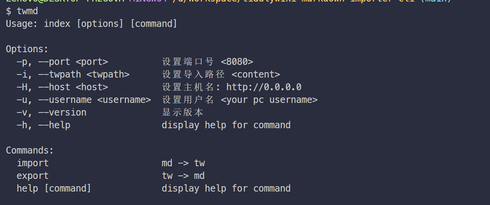

# tiddlywiki-markdown-importer-cli

> [!WARNING]
> 目前针对简单情况的markdown可以一键批量导入到tiddlywki, 但是真实情况下, 每个用户的情况都不同, 需要进行不同程度的支持, 和错误处理(暂时没有相关反馈, 无法更近一步处理 见 [issue1](https://github.com/oeyoews/tiddlywiki-markdown-importer-cli/issues/1))

* 导入导出都是对于tiddlywiki(tw)而言的, 或者说主体都是markdown(md).
* 导入: 从本地markdownd(md)导入到tiddlywiki, 即markdown的导入 (md -> tw)
* 导出: 从tiddlywiki 导出到本地markdown, 即markdown的导出 (tw -> md)

## Feature

* 导入的文件使用原markdown文件创建/修改时间, 不会导致时间线乱掉
* 支持markdown的导入,导出
* ...

## Usage

```bash
npm i -g tiddlywiki-markdown-importer-exporter-cli
twmd -h
twmd import -i content -p 8080 # md -> tw
twmd export -i content -p 8080 # tw -> md
```

## TODO

* [x] url test ping
- [x] 写入文件的创建,修改时间
- [x] suport import markdown file
- [x] suport export markdown file(tiddlywiki 插件版本: markdown obsidian manager)
- [x] ncc 打包成cli
- [x] 支持参数, 配置文件读取
- [x] release npm package
- [x] supoprt parse yml
- [x] 默认读取当前目录下的 `content` 目录
- [x] 如何本地测试npm package link?
- [x] exporter suppor cli
- [x] 名字错乱(支持导入md&&md.meta)
- [x] yml 异常语法校验, 异常捕获
- [x] windows 下路径有问题
- [x] support markdown exporter (tiddlywiki 插件版本:  markdow exporter)
- [ ] 相对路径的图片路径处理
- [ ] cli 自动发包
- [ ] 重构代码
- [ ] etag ??
- [ ] 支持验证(password)
- [ ] support wikitext to markdown: 如果用户使用到了macro等高级tw语法, 这一步不可能也不能做到, tid 的meta信息可以借助gray-matter 来处理
- [ ] 接入三方api(notion)
- [ ] 浏览器扩展

## NOTE

* 文件使用LF, 否则打包的时候, 第一行的shebang会和代码混在一起(for developers)
* notion 导出的markdown, 不遵循 YML 语法

## Links

* https://bramchen.github.io/tw5-docs/zh-Hans/#WebServer%20API%3A%20Get%20Server%20Status
* headers.append('Authorization', 'Basic ' + btoa(user + ':' + password));
* https://bramchen.github.io/tw5-docs/zh-Hans/#ListenCommand
* https://github.com/Jermolene/TiddlyWiki5/pull/7471
* https://talk.tiddlywiki.org/t/question-how-to-render-json-instead-of-html-and-save-the-results-to-a-json-file/4910/15


```markdown
# title


Tag: xxx
Last update: xxx

# 正文部分

xxx
```


<!-- // 针对本地太微nodejs(无密码)实例
// 写入, 导出, 更新, 查询, 删
// TODO: 需要做好条目重写的提示
// https://github.com/Jermolene/TiddlyWiki5/blob/4b56cb42983d4134715eb7fe7b083fdcc04980f0/core/modules/server/server.js#L31
// https://github.com/Jermolene/TiddlyWiki5/blob/4b56cb42983d4134715eb7fe7b083fdcc04980f0/core/modules/server/routes/put-tiddler.js -->