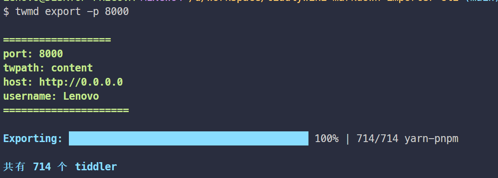

# tiddlywiki-markdown-importer-cli

> [!WARNING]
> alpha ...
> 目前针对简单情况的markdown可以一键批量导入到tiddlywki, 但是真实情况下, 每个用户的情况都不同, 需要进行不同程度的支持, 和错误处理(暂时没有相关反馈, 无法更近一步处理 见 [issue1](https://github.com/oeyoews/tiddlywiki-markdown-importer-cli/issues/1))

## TODO

- [x] 写入文件的创建,修改时间
- [x] suport import markdown file
- [x] suport export markdown file(tiddlywiki 插件版本: markdown obsidian manager)
- [x] ncc 打包成cli
- [x] 支持参数, 配置文件读取
- [x] release npm package
- [x] supoprt parse yml
- [ ] 相对路径的图片路径处理
- [ ] support markdown exporter (tiddlywiki 插件版本:  markdow exporter)
- [x] 默认读取当前目录下的 `content` 目录

## NOTE

notion 导出的markdown, 不遵循 YML 语法

```markdown
# title


Tag: xxx
Last update: xxx

# 正文部分

xxx
```


<!-- // 针对本地太微nodejs(无密码)实例
// 写入, 导出, 更新, 查询, 删
// TODO: 需要做好条目重写的提示
// https://github.com/Jermolene/TiddlyWiki5/blob/4b56cb42983d4134715eb7fe7b083fdcc04980f0/core/modules/server/server.js#L31
// https://github.com/Jermolene/TiddlyWiki5/blob/4b56cb42983d4134715eb7fe7b083fdcc04980f0/core/modules/server/routes/put-tiddler.js -->